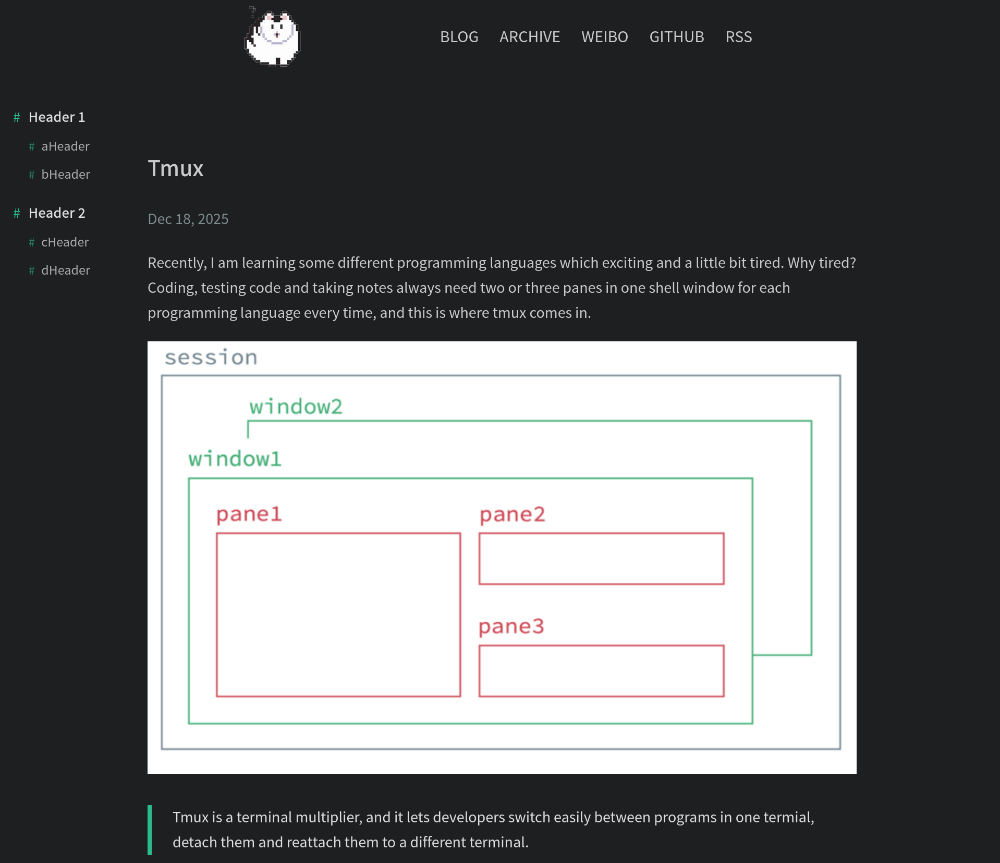

🌑 Apollo Dark: 本主题 Fork 自 [hexo-theme-apollo](https://github.com/pinggod/hexo-theme-apollo)，并重制为深色模式。

---



## 文档

- [中文文档](./doc/doc-zh.md)
- [Document](./doc/doc-en.md)

## 安装

``` bash
hexo init Blog 
cd Blog 
npm install
npm install --save hexo-renderer-jade hexo-generator-feed hexo-generator-sitemap hexo-browsersync hexo-generator-archive
git clone https://github.com/ssfortynine/hexo-theme-apollodark.git themes/apollodark
```

## 启用

修改 `_config.yml` 的 `theme` 配置项为 `apollodark`:

```yaml
theme: apollodark

# 在归档页面显示所有文章
# 需要上面安装的 hexo-generator-archive 插件支持
archive_generator:
    per_page: 0
    yearly: false
    monthly: false
    daily: false
```

## 更新

``` bash
cd themes/apollodark 
git pull
```

## 贡献

该版本为`hexo-theme-apollo`的Fork版本，增加功能如下：
- 默认主题背景颜色为暗色
- 增加目录功能
- 增加评论功能

`hexo-theme-apollo`版本仓库：https://github.com/WhoKnowInfinity/hexo-theme-apollo

## License

MIT
